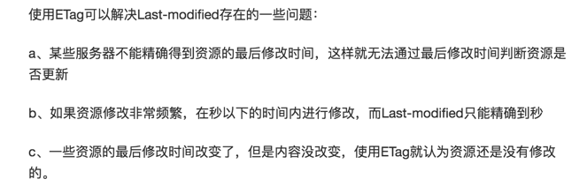
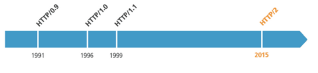

# frontEndHandbook
整理的关于前端的一些知识，不定期更新。

> ### 关于缓存
##### (1) 为什么要缓存？
- 减少带宽消耗
- 降低服务器压力（用户和爬虫角度）
- 提升用户体验
- https://www.cnblogs.com/btgyoyo/p/6125159.html
##### (2) 有哪些缓存？
- 数据库缓存
- CDN 缓存
- 代理服务器缓存
- 浏览器缓存
- 应用层缓存

##### (3) 怎么做？
- 后端通过set-cookie 进行设置
##### (4) CDN 和代理服务器的区别是什么？
- CDN 加速静态资源，反向代理做动态资源的负载均衡
- 什么是CDN？如果我在广州访问杭州的淘宝网，跨省的通信必然造成延迟。如果淘宝网能在广东建立一个服务器，静态资源我可以直接从就近的广东服务器获取，必然能提高整个网站的打开速度，这就是CDN。CDN叫内容分发网络，是依靠部署在各地的边缘服务器，使用户就近获取所需内容，降低网络拥塞，提高用户访问响应速度。
- 反向代理，代理服务器，降低用户对系统的理解复杂度。
##### (5) 缓存和304 的关系 
304 表示未修改，意思就是自从上次缓存过后页面未被修改过。那么这个未修改是如何定义的，可以通过以下两种方式：Last-modified & ETag

- Last-modified 的意思就是说每次服务器有修改的时候会告诉客户端修改时间是多少，客户端下次请求的时候会携带这个数据让服务器检查从这个时间以后是否有发生过修改，如果没有则返回304，如果有修改则返回200 以及请求的内容。
- ETag 是请求内容的一个hash 值，服务器返回给客户端请求内容的同时会返回一个ETag，客户端下次请求同样的内容时会携带ETag，服务器端通过对比这个ETag 和目前做的ETag 来判断资源是否被修改。如未被修改则返回304，否则返回200.
- ETag 相对于Last-modified 的优势

- http://web.jobbole.com/85243/
##### (6) CDN 和DNS 的关系
网页打开的时候先去找DNS 拿到最近的CDN 服务器地址，然后去请求CDN 服务器，CDN 服务器去请求真正的服务器拿数据并缓存。
##### (7) 强缓存和协商缓存
- 强缓存：直接读缓存
- 协商缓存：先确定缓存是否有效（304）
- https://www.cnblogs.com/wonyun/p/5524617.html 

> ### 关于Http
##### (1) Http 历史

##### (2) Http 基本优化
- 影响Http 网络请求速度的因素：带宽和延迟
    - 延迟包含：
        - 浏览器阻塞，对于同一个域名，请求数有限制，超过最大请求数就会阻塞
        - DNS 查询，可以利用DNS 缓存优化
        - 建立连接，三次握手
##### (3) Http 1.0 与Http 1.1
- 缓存处理：1.0 使用If-Modified-Since,Expires。1.1 引入更多的缓存策略如Entity tag，If-Unmodified-Since, If-Match, If-None-Match。
- 带宽优化及网络连接使用：1.1 允许请求资源的某个部分，返回码是206
- 错误通知处理：1.1 增加多个错误响应状态码
- Host 头处理：1.0 默认一台主机只有一个ip，但是1.1 不一样，需要写到host 头部信息
- 长连接：1.1 默认长连接，可以在一个tcp 连接上发送多个http 相应和请求
- 存在的问题
    - 多次建立连接，增大延迟
    - 明文传输，不安全
    - header 里携带的内容过大，且每次不怎么变化，浪费流量
    - 长连接使用多了会造成性能压力
##### (4) Http 与Https
- 网景于1994 年创建Https
- Https = Http + SSL(TLS)
- Http 端口80，Https 端口443
- Https 是通过对明文信息进行加密保证信息的安全性，防止运营商劫持。涉及到加密就需要有密码，为了保证安全性需要使用非对称加密 + 对称加密的方式进行。涉及到非对称加密就要有公钥和私钥，涉及到公钥私钥就要有证书，因此Https 协议需要向CA 购买证书。
##### (5) Https 与Http2
- Https 消耗大，只能解决安全问题，解决不了性能问题，而且加解密的过程实际上会造成性能问题。于是出现了Http2
- Http2 支持明文传输、使用新的二进制格式、压缩消息头、多路复用（连接共享，只有一个Tcp 连接，双工通信）、服务端推送

> ### 关于Http Header
##### (1) Http Header 分为以下四种：
- 通用Header
- Request Header
- Response Header
- 实体Header

##### (2) 通用Header 包含哪些内容？
- 缓存管理：Cache Control
- 连接管理：Connection
- 日期：Date
- Pragma：Cache Control 向后兼容
- Transfer Encoding、Upgrade、Via、Warning

##### (3) Request Header 包含哪些内容？
- 我是谁：User-Agent、Authorization、Proxy-authorization
- 我从哪里来：From、Referer
- 我要到哪里去：Host、Max-forwards
- 我想要什么：Accept、Charset、Encoding、Language、Expect、TE
- 我有什么要求：If-Match、If-none-match、If-modified-since、If-range、If-unmodified-since

##### (4) Response header 包含哪些内容？
- 你是谁：WWW-anthenticate
- 我是谁：Server
- 你要的我有没有：Accept-ranges、Etag、
- 谁那里有：Location
- 现在暂时没有：Retry-after

##### (5) 实体Header 包含哪些内容？
- Allow
- Content Encoding、Content Language、Content Type、Content Length、Content-location、Content-Range
- Expires、Last Modified

##### (6) Cookie 相关
- Set Cookie
- Cookie

##### (7) 其他Header
- X-Frame-Options、X-XSS-Protection、DNT、P3P

> ### JavaScript 加载方式
- 默认为同步加载，即加载会阻断渲染过程，用户体验较差。
- 使用了defer （H4 中的属性）属性后，脚本异步加载，同步执行，及在渲染的同时加载，但是在渲染之后才执行，多个脚本可以保证加载顺序。引入脚本时添加type=module 属性相当于默认打开了defer。
- 使用了async （H5 新增，IE9 以上）属性后，脚本异步加载和执行，在渲染过程中加载，加载完了立马就执行会阻断渲染过程，多个脚本不能保证加载顺序。

> ### ES6 与CommonJs 模块的差异
- CommonJs 输出的是一个值的复制，存在输出缓存机制，ES6 输出的是值的引用。
- CommonJs 是运行时加载，ES6 是编译时输出接口。
- CommonJs 顶层this 指向当前模块，ES6 顶层this 指向undefined。

> ### 一句话聊设计模式
- 简单工厂：就是一个提供不同类原型的统一方法。包括两部分，类和导出类的接口，修改时也要修改两部分。
- 工厂方法：在工厂类的原型上添加属性，每个属性对应一个类。修改时只需修改一部分。
- 抽象工厂：抽象类为父类，其方法不能被调用，只能被重写
- 单例模式：每个类只有一个实例，可以用来实现命名空间的管理      
- 外观模式：解决浏览器兼容问题，比如addEventListener and addEvent
- 适配器模式：接口转换，比如说从使用内部框架A 到使用JQuery
- 装饰者模式：对现有对象的方法和属性的添加
- 桥接模式：将元素事件与业务逻辑解耦
- 组合模式：将对象组合成树形结构以表示部分与整体之间的层次关系
- 享元模式：抽象对象之间的共同内容，可以端翻页
- 模板方法模式：子类继承封装了核心方法的父类
- 观察者模式：以低耦合的方式实现类和对象之间的通信
- 状态模式：解决程序中臃肿的分支判断
- 策略模式：类似状态模式，但是不需要维护状态列表
- 职责链模式：解决请求的发送者与请求的接受者之间的耦合
- 命令模式：解决命令的发起者与执行者之间的耦合
- 访问者模式：解决数据与数据操作方法之间的耦合问题
- 中介者模式：类似观察者模式，解耦模块之间的复杂通信
- 备忘录模式：使用缓存，比如说缓存翻页数据，再次翻页回去不需要请求
- 迭代器模式：顺序访问集合中的元素，可以优化循环语句
- 解释器模式：语义抽象，demo 为统计当前点击元素路径
- 节流模式：滚动监听、动画展示、懒加载、统计打包
- 简单模板模式：利用html 模板生成字符串插入dom 中减少操作成本

> ### 渐进增强及优雅降级
- 这两个是Css3 出现之后才被经常提及的概念，因为有的旧版本浏览器不兼容Css3 的强大特性，所谓的渐进增强和优雅降级的区别就在于让代码先去适配哪种浏览器。
- https://www.jianshu.com/p/d313f1108862

> ### 伪元素和伪类的区别
- 伪元素产生元素（比如文字前面带个小圆圈或者方框之类的点缀），伪类产生类（比如说给文字第一行设置样式）
- Css1 和Css2 伪元素和伪类都是使用单冒号来表示，Css3 规定伪元素使用双冒号来表示，但是由于部分浏览器的兼容性，所以大家还都是习惯使用单冒号来表示伪元素和伪类，因此导致了混淆
- https://swordair.com/origin-and-difference-between-css-pseudo-classes-and-pseudo-elements/

> ### 没有银弹
- 这篇经典论文的核心论述通常被解释为复杂的软件工程问题无法靠简单的答案来解决。该论述中强调真正的银弹并不存在，而所谓的没有银弹则是指没有任何一项技术或方法可以能让软件工程的生产力在十年内提高十倍。

> ### 实现异步的方式有哪些
- 事件
- Promise
- SetTimeOut
- Generator 函数
- 回调函数
- 发布订阅

> ### NodeJs 全局对象
- global、__filename、__dirname、setTimeout、clearTimeout、setInterval、console、process
- http://www.runoob.com/nodejs/nodejs-global-object.html

> ### 关于RequestAnnationFrame
##### (1) 为什么
- 用来实现动画效果，传统的实现动画效果的方式是使用setTimeout 或者setInterval，有以下几个问题：
  - 如何确定正确的时间间隔？（浏览器和硬件性能不同）
  - 毫秒的不精确性
  - 如何避免过度渲染
- 归根接地，问题的根源在于时机。

##### (2) 怎么做
- 注册回调函数 -> 浏览器更新时触发animate -> 触发所有注册的callback

##### (3) 能解决什么问题：
- 控制绘制频率
- 实现css3 不能实现的东西，比如scrolltop，还有一些动画效果
- 向下兼容

##### (4) Ref
- https://www.zhangxinxu.com/wordpress/2013/09/css3-animation-requestanimationframe-tween-%E5%8A%A8%E7%94%BB%E7%AE%97%E6%B3%95/
http://taobaofed.org/blog/2017/03/02/thinking-in-request-animation-frame/

> ### 关于OPTIONS 请求
##### (1) 有什么用
- 获取服务器支持的HTTP请求方法；也是黑客经常使用的方法
- 用来检查服务器的性能。例如：AJAX进行跨域请求时的预检，需要向另外一个域名的资源发送一个HTTP OPTIONS请求头，用以判断实际发送的请求是否安全。
##### (2) 跨域产生时机
- 跨域时的非简单请求会触发OPTIONS 预检，所谓的非简单请求包含以下三个条件
  - 只能是Get、Head、Post方法
  - Http 头信息不超出以下几个字段：Accept、Accept-Language、Content-Language、Last-Event-ID
  - Content-Type只能取这几个值：
    - application/x-www-form-urlencoded
    - multipart/form-data
    - text/plain

> ### 前端性能优化的方式
- 代码压缩
- 减少http 请求：如雪碧图
- 使用cdn 加速
- 资源懒加载或预加载
- 监听节流
- 合理利用缓存

> ### 单页面应用及SEO
##### (1) 单页面应用
- 由一个外壳页面和多个页面片段构成
- 页面跳转不涉及整个页面的刷新
- 用户体验好，开发难度高
- SEO 需要单独做方案
##### (2) 如何做SEO
- SSR
- 预渲染

> ### unicode 和utf-8、utf-16、utf-32 的区别
- unicode 是字符集，是所有字符与数字的对应关系
- utf 系列是字符集编码规则，就是如何将字符对应的数字存储在计算机中
- utf-8、utf-16、utf-32 的不同之处就在于它们默认的基数单位不同，utf-8 的基数单位是一个字节，urf-16 的基数单位是两个字节，utf-32 是四个字节

> ### 重绘(Repaint)与重排(Reflow)
##### (1) 重绘
- 重绘是一个元素外观的改变所触发的浏览器行为，例如改变outline、背景色等属性。浏览器会根据元素的新属性重新绘制，
- 使元素呈现新的外观。重绘不会带来重新布局，所以并不一定伴随重排。
##### (2) 重排
- 页面布局发生变化需要重排
- 重排必然导致重绘
- 重排的成本要比重绘高
##### (3) 如何优化
- 多次样式属性操作合并为一次
- 需要频繁重排的元素设置为绝对定位，例如有动画效果的元素
- 如果要对一个元素进行复杂操作，可以先用display: none 进行隐藏，操作完成后再进行显示