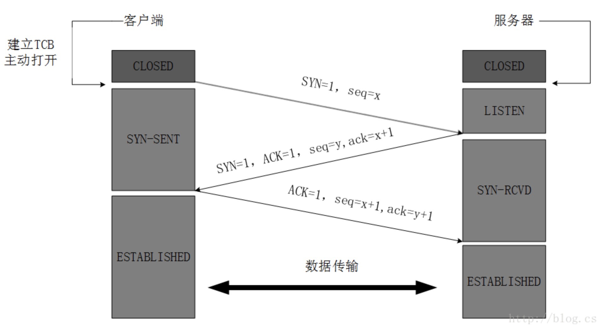
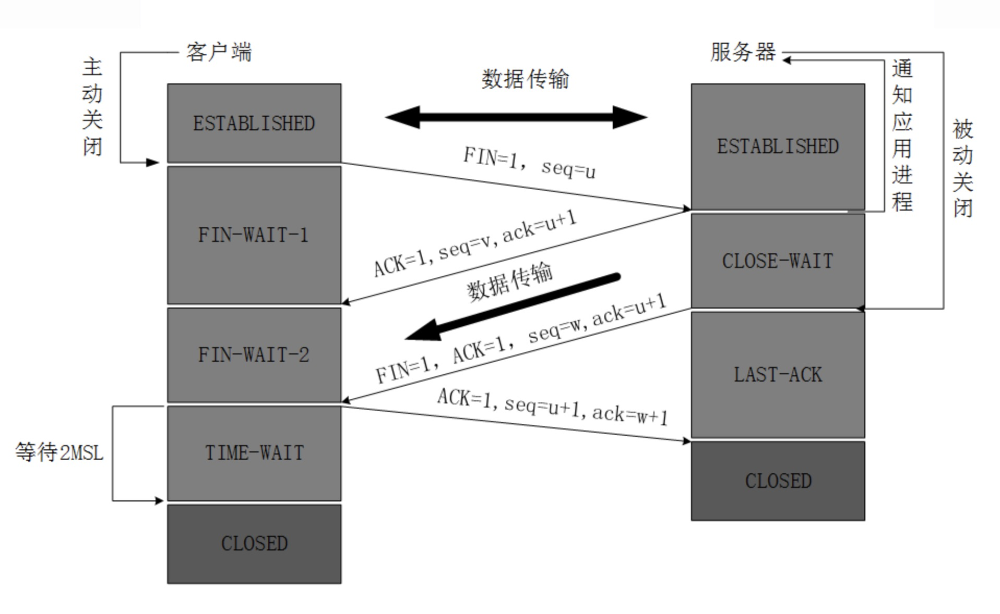

# 计算机网络相关
> ### 三次握手
- 客户端发送SYN = 1, seq = x
- 服务器回应SYN = 1, ACK = 1, seq = y, ack = x + 1
- 客户端回应ACK = 1, seq = x + 1, ack = y + 1

> ### 四次挥手
- 客户端发送FIN = 1, seq = u, 发送结束客户端进入FIN-WAIT-1 状态
- 服务器回应ACK = 1, seq = v, ack = u + 1, 发送结束服务器进入CLOSE-WAIT 状态，客户端接收到信息后进入FIN-WAIT-2 状态
- 服务器发送FIN = 1, ACK = 1, seq = 2, ack = u + 1, 发送结束服务器进入LAST-ACK 状态
- 客户端发送ACK = 1, seq = u + 1, ack = w + 1, 发送结束客户端进入TIME-WAIT 状态，2MSL 之后进入CLOSED 状态，服务器接收到细心后进入到CLOSED 状态

