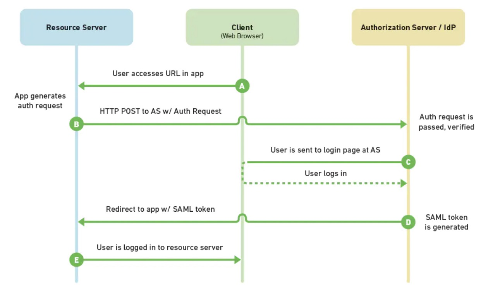

# 前后端鉴权二三事
本文尝试从认证与授权两个维度来描述标题中的鉴权，大部分篇幅还是偏认证，因为笔者目前在日常开发中面临更多的场景还是认证。
## 认证与授权
首先，我们来简单看一下认证与授权，并理清楚两者之间的区别。
### 认证（Authentication）
认证涉及一方应用和一方用户，用于描述用户在该应用下的身份。认证可以简单理解为登录，以此确认你是一个合法的用户。比如说掘金必须要登录才能点赞、收藏。而你一旦登录了，那么相应的就有了在掘金上特定的权限，比如说你可以编辑和删除自己的文章，但是不能操作别人的，除非你登录用的账号是超级管理员。从这个意义上看，你在登录的瞬间，你在所登录网站上的权限就已经确定了。
### 授权（Authorisation）
授权涉及两方应用和一方用户，用于描述第三方应用有哪些操作权限。比如说你在外卖小程序中叫外卖，可以一键点击允许当前小程序获得你微信绑定的手机号，此时相当于你把你存放在微信的手机号数据授权给外卖小程序使用。
### 带入场景区分认证与授权
我们分别举三个例子来说明三种情况让大家对认证和授权的关系有更好的理解：只认证不授权、即认证又授权、不认证只授权。
#### （1）只认证不授权
上面提到的使用掘金账号登录掘金就是只认证不授权的场景，此时掘金只知道你是哪个用户，但是不涉及到授权的操作。
#### （2）即认证又授权
同样是登录掘金，我们可以不使用在掘金注册的账号和密码登录，而选择第三方应用登录，比如说github 账号。此时会弹出github 的登录页面，如果你在此页面输入账号和密码进行登录，则相当于默认授权给掘金获取你的github 的头像和账号名，有的网站在授权时会提醒用户当前授权操作可以给第三方应用提供哪些信息。在这个过程中即完成了认证（合法用户）又完成了授权（你允许掘金从github 获取你的信息）。
#### （3）不认证只授权
回到上面我们讲到的外卖小程序的例子，在你第一次进入外卖小程序的时候小程序会弹框请求获取你的个人信息，此时相当于上面提到的即认证又授权。你同意以后就相当于使用微信账号登录，但是此时外卖小程序获取到的你的信息不包括你的手机号。当你要下单点击提交的时候，小程序再次发起请求，要获取你微信绑定的手机号，此时发生的动作就是不认证只授权。

## 有哪些常用的认证和授权方式？
一旦涉及认证，必须要考虑的一个问题就是状态管理。所谓的状态管理就是说我们在一个网站进行登录之后的一段时间里，不希望每次访问它都需要重新登录，所以应用开发者必须要考虑怎么样保持用户的登录状态以及决定何时失效。而这个过程需要前后端通力合作来完成。下面介绍几种常见的认证和授权方式。
### Session-Cookie 认证
Session-Cookie 的认证流程如下：用户先使用用户名和密码登录，登录完成后后端将用户信息存在session 中，把sessionId 写到前端的cookie 中，后面每次操作带着cookie 去后端，只要后端判断sessionId 没问题且没过期就不需要再次登录。

使用这种方式进行认证，开发者可能面临的主要问题如下：
- cookie 安全性问题，攻击者可以通过xss 获取cookie 中的sessinId，使用 httpOnly 在一定程度上提高安全性
- cookie 不能跨域传输
- session 存储在服务器中，所以session 过多会耗费较大服务器资源
- 分布式下session 共享问题
### Token 认证
与上面的Session-Cookie 机制不同的地方在于，基于token 的用户认证是一种服务端无状态的认证方式，服务端可以不用存放token 数据，但是服务器可以验证token 的合法性和有效性。使用token 进行认证的方式这里主要介绍两种：JWT 和SAML.
#### JWT（JSON Web Token）
关于JWT 的文章有很多，具体信息可以参考阮一峰老师的入门文章：[JSON Web Token 入门教程](http://www.ruanyifeng.com/blog/2018/07/json_web_token-tutorial.html)（预计阅读时间：2mins）

简言之，JWT 就是一种在用户登录后生成token 并把token 放在前端，后端不需要维护用户的状态信息但是可以验证token 有效性的认证及状态管理方式。

文章里已经有的内容这里不过多探讨，想聊一聊的是在此基础之上延伸出的两个问题：

##### （1）JWT 用于签名和验证签名的secret 对于所有人来说都是一样的吗？
如果一样的则存在比较大的安全隐患，一旦泄露，所有JWT 都可能会被破解。如果不一样，那么同样需要在服务器端维护每一个人对应的secret 信息，这样的话和服务器端维护session 信息又有什么区别呢？

##### （2）同一个人不同时间登录的secret 是一样的吗？

#### SAML (Security Assertion Markup Language)

SAML 的流程如下：
- 未登录的用户通过浏览器访问资源网站（Service Provider，简称SP）
- SP 发现用户未登录，将页面重定向至IDP（Identity Provider）
- IDP 验证请求无误后，提供表单让用户进行登录
- 用户登录成功后，IDP 生成并发送SAML token (XML对象) 给SP
- SP 对token 进行验证，解析获取用户信息，允许用户访问相关资源

针对上面的流程补充两点信息：

##### （1）SP 是如何验证token 的有效性？
比如是否有可能token 在IDP 到SP 的过程中被人劫持并修改了内容？答案是：没有可能。因为IDP 返回给SP 的token 使用IDP 的私钥进行了签名，而通过私钥签名后的信息可以通过对应的公钥进行验证。这也就回答了SP 如何验证token 的有效性这一问题。这个问题的答案来自于：[SAML](https://www.cnblogs.com/maxigang/p/9051257.html)

##### （2）SP 如何判断token 是否过期？
SAML token 携带了token 过期时间的信息。这个问题的答案来自于：[SAML2.0入门指南](https://www.jianshu.com/p/636c1ee16eba/)

##### （3）生成的SAML token 是托管在SP 还是前端？
如果是托管在SP，那么又要引入session 机制，如果托管在前端，那么前端需要存储并且每次传递SAML token，但是SAML token 大小又比较大，耗费传输资源。

答案是：都可以。放在前端的话需要前端通过单独的ajax 请求获取token 并存储在localStorage 或者其他的本地存储中。如果是托管在SP，那么就像上面说的，引入session，前端只掌握sessionId，这样的话token 机制其实就退化成了上面提到的session-cookie 机制。这个问题的答案来自于：[单点登录之SAML](https://www.jianshu.com/p/54fb071e1036)

关于SAML 的更多信息可以参考：[不要用JWT替代session管理（上）：全面了解Token,JWT,OAuth,SAML,SSO](https://juejin.im/post/5b3b870a5188251ac85826b8#heading-3)

### OAuth 授权
> OAuth 的本意是一个应用允许另一个应用在用户授权的情况下访问自己的数据，OAuth 的设计本意更倾向于授权而非认证（当然授权用户信息就间接实现了认证）

## SSO 与CAS
接下来我们探讨一个企业应一定绕不过的课题，单点登录。举例来说，华为云DevCloud 下有那么多微服务，比如项目管理、代码托管、代码检查、流水线、编译构建、自动化测试等，用户如果在使用任意一个服务没有登录的时候都需要去同一个地方进行登录认证，登录之后的一段时间内可以无需登录访问所有其他服务。

在单点登录领域，CAS（Central Authentication Service，中文名是中央认证服务） 是一个被高频使用的解决方案。因此，这里介绍一下利用CAS 实现SSO。而CAS 的具体实现又可以依赖很多种协议实现，这里重点讲解一下CAS 协议。

### 概念

简单介绍一下CAS 协议中的几个重要概念，一开始看概念可能很模糊，没关系，先大概过一遍，结合下面的流程理解起来更顺畅。

- CAS Server：用于认证的中心服务器

- CAS Clients：保护CAS 应用，一旦有未认证的用户访问，重定向至CAS Server 进行认证

- TGT& TGC：用户认证之后，CAS Server 回生成一个包含用户信息的TGT (Ticket Granting Ticket) 并像浏览器写一个cookie（TGC，Ticket Granting Cookie），有啥用后面流程会讲到

- ST：在url 上作为参数传输的ticket，受保护应用可以凭借这个ticket 去CAS Server 确认用户的认证是否合法

### 流程

介绍完概念，结合官方给出的流程图，对每一步进行详细的拆解，并点出几个可能会存在疑惑的问题。

① 用户通过浏览器访问受保护应用（以下简称app_1）首页

② app_1侧的CAS Client 检测到用户未进行过认证，将用户重定向（第一次重定向）到CAS Server，url 上携带的参数service 包含了app_1 的访问地址

③ CAS Server 检测到用户没有TGC，提供表单让用户登录，用户登录成功后，CAS Server 生成包含用户信息的TGT，并写TGC 到用户浏览器的cookie。

- TGC 跟TGT 相关联，是用户浏览器直接向CAS Server 获取ST 的票据，如果TGC 有效，用户就不需要完成表单信息填写的步骤直接实现登录，这个过程在后面会提到

④ CAS Server 把浏览器重定向（第二次重定向）回app_1首页，此时重定向的url 携带了ST

⑤ app_1 再次接收到用户浏览器的访问，把上一步url 参数中的ST 拿出来，凭着ST 去CAS Server 确认当前用户是否已经完成认证，CAS Server 给出肯定回复以后，app_1 拿掉url 上的ST 重定向（第三次重定向）浏览器至app_1 首页 

-  app_1（CAS Client）凭借ST 去向CAS Server 确认当前用户认证状态的同时获取了包含用户信息在内的额外信息
- 把这些额外信息写到session 里并把sessionId 返回给前端，那么前端下一次访问的时候直接判断session 是否有效就可以了

⑥ 用户端浏览器去访问同一认证体系下的app_2 首页

⑦ 同第②步

⑧ CAS Server 检测到用户浏览器的TGC，找到对应的TGT，经验证是合法的，此处呼应了第③步的TGC

⑨ 同第④步

⑩ 同第⑤步

### 一些问题

过程讲完了，现在开始抛问题

（1）TGC 过期规则是什么，如何设置？

可以在cas.properties中进行配置，默认八小时，无操作，默认两小时。
（2）ST票据过期配置，默认时间是10秒钟。所以需要用ST换取token？然后用session 管理token，可以维持一个小时不过期
Ref：

https://blog.csdn.net/yushenzaishi/article/details/80435343

## Ref
- 傻傻分不清之 Cookie、Session、Token、JWT：https://juejin.im/post/5e055d9ef265da33997a42cc#heading-22
