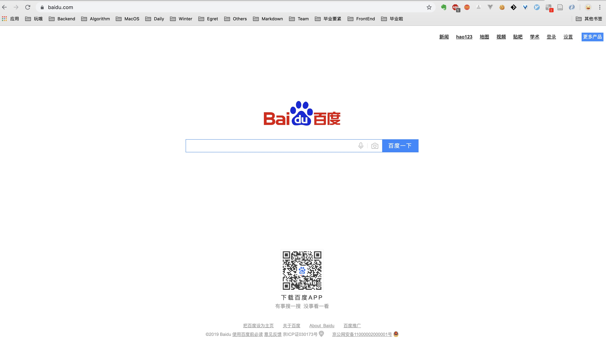
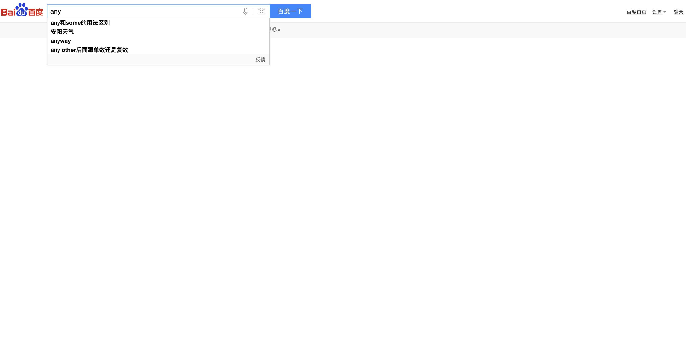

#### 从黏知了的角度来看前端

小时候的夏天，喜欢出去黏知了。手里拿根针，针上穿一根长长的线，然后在线尾打个结。黏到知了以后，用针从知了的腹部刺过，知了就挂在了线上。辛苦劳作一下午，线上就穿满了知了，此起彼伏的知了叫声让我觉得特别有成就感。

在这里，我想用类似穿知了的方法以一个例子（百度首页）穿起前端的概念和知识点，中间也会夹杂着各种技术的演技和变迁。今晚，咱们只谈理论，不聊实践。

##### 页面展示

百度的首页是一个简单的页面，主要分为三部分，头部的多个链接，中间的搜索框，和下边的二维码广告等。

构成这个页面有两个必不可少的要素：元素和样式。元素决定了展示什么（文字、图片、链接、按钮、文本框等），样式决定如何展示（宽高、位置、颜色、背景色、圆角、旋转、动画等）。所有的静态页面都是由这两个要素组成，要想能顺利地完成页面绘制工作，必须要了解到HTML和CSS相关的知识点如下（所有标有教程两个字的内容快速过，以了解语法为主，现用现查）：
- HTML教程：https://www.runoob.com/html/html-tutorial.html
- HTML5语义化标签：http://www.daqianduan.com/6549.html
- CSS教程：https://www.runoob.com/css/css-tutorial.html
- CSS盒子模型：https://blog.csdn.net/qq_34966814/article/details/82872971
- CSS position属性：https://www.cnblogs.com/guolao/p/9048308.html

##### 前端与后端
现在，尝试在百度中间的文本框中输入任何内容，发现页面的展示发生了变化。

一方面，输入框从中间移到了header的位置，其他的信息都消失了。另一方面，输入框中的下拉出现了跟我输入的内容相匹配的一些选项。

（1）前端

要完成第一条变化，需要有东西检测到我的文本框输入发生了变化，并对页面中的元素进行了隐藏或移位，这个东西就是javascrit，是一种在浏览器端运行的脚本语言。如果你已经有其他语言的基础，可以快速过一遍js的教程，看一下相关内容的语法和使用方式
- JS教程：https://www.runoob.com/js/js-tutorial.html

JS跟其他语言一个很大的不同就在于，JS能操作网页上的DOM元素，为了防止有两个线程同时对同一个DOM元素做不同的操作，所以JS只能是单线程。单线程的情况下如果某一部分的代码出了问题，那整个应用都会完蛋，所以异步的机制在这种语言里大行其道。
- 为什么JS是单线程：https://www.cnblogs.com/langzianan/p/8403330.html
- JavaScript异步：https://www.imooc.com/article/71726

（2）后端

要完成第二条变化，即下拉框中弹出与你搜索的关键词相匹配的内容，只靠前端是难以解决的，因此这里就要牵扯到后端。其中的执行过程为：js检测到输入发生变化，像后端发送一个请求，把变化的内容发给后端（服务端），服务端通过数据库中的数据匹配返回跟你查询的内容相似度较高的选项。

说到这里，需要弄明白的一点是前端和后端的区别是什么。前端和后端的概念说起来可能只有三两句话，但是对于新手来说要想理解还是有一点点困难。我想在这里举一个生活中的例子，就以我们每天都会去的食堂作为模板。

在食堂这个体系下，打菜的窗口和阿姨就是前端，厨房里做菜的厨师就是后端。如果把食堂里一半窗口的打菜工作人员换成年轻漂亮的小姑娘，男生们肯定都喜欢去这些窗口打菜。但是，需要明白的一点是，这些窗口的菜并不一定好吃，菜好不好吃是由每个窗口后面的厨房（假定每个窗口都有一个单独的厨房供应饭菜）决定的。所以，前端是用户能够直接看到和感知到的东西，但是用户体验好不好却要分为两个方面，一是打菜的小姑娘好不好看（前端展示的内容和效果好不好），二是厨师做的菜好不好吃（后端服务器的综合能力，可能包括数据处理、并发能力、数据真实性等若干）。

##### 数据获取--Ajax
上面提到，前端需要像后端发起请求，拿数据。那这个过程是如何完成的，这就引出了本小节的主角——ajax。Ajax是一种局部刷新的技术，即通过最小的代价完成和后端的数据交互，刚刚我们在百度搜索框中输入内容，页面产生变化的时候并没有发现页面有刷新的现象，这就是所谓的局部刷新，每次只改动最少的部分已完成相应的改变。
- Ajax入门：https://github.com/qianguyihao/Web/blob/master/09-Ajax/02-Ajax%E5%85%A5%E9%97%A8%E5%92%8C%E5%8F%91%E9%80%81http%E8%AF%B7%E6%B1%82.md
- Ajax教程：https://www.runoob.com/ajax/ajax-tutorial.html

##### 浏览器调试
前端和后端进行数据交互，就要牵扯到两个甚至更多个开发人员的合作。合作的时候出了问题，是谁的责任。比如说两人合作开发的网站或者开发过程中的数据显示有误或者根本显示不出来，我如何才能知道是前端还是后端的问题导致了这个结果？这个问题的答案，浏览器在F12里已经给我们藏了很多年，打开F12开发者模式，不光能看到数据的请求、获取情况，还可以调试js、html、css等任何属于前端开发范畴的内容。
- 浏览器调试：http://www.imooc.com/learn/759

##### 前端模块化
如果你已经扫了几眼JS的教程，就会发现跟高级语言（C、Java）相比，JS语言的风格非常随意。变量不用声明类型，甚至不用声明，函数不用声明返回值，基本上就是怎么写都可以的感觉。这种特性一方面会让开发者觉得写出能运行到的代码很容易，一方面很难保证代码的稳定性和健壮性。

因此，在ES5之后（全称是ECMAScript 5，是JS发展过程中某一阶段的规范，也是浏览器端可以直接识别及运行的最高ES标准），相继出现了ES6、7、8、9、10，TypeScript（JS的超集，除了支持JS语法外，有更多的语法，比如类型声明等）等。每一次标准的更新或新语言的出现都对JS的语法做出了更多的限制及扩展，使得JS成为一门越来越规范的语言，目前开发中，大部分的语法都属于ES6.
- ES6标准入门（当字典用）：http://es6.ruanyifeng.com/


##### 前端框架
上面提到，前端页面的变化是由JS控制dom元素的隐藏、消失或样式的变化来实现的，一个很经典的用法如下：
```js
 var para = document.getElementsByTagName("p"); // 返回网页中所有的p元素
 para[0].setAttribute("title", "a list of goods"); // 给第一个p元素设置一个title
```
因此，最早的JS代码里充斥着像这种获取DOM和操作DOM的代码。但是由于互联网发展早期的浏览器厂商之间的竞争和DOM技术的发展，不同浏览器对于不同代码的兼容性不是特别好，一个很典型的例子就是为DOM添加监听事件：
```js
// this code is very old
function addEvent(elm, evType, fn, useCapture) {
  if (elm.addEventListener) {
    elm.addEventListener(evType, fn, useCapture); // DOM2.0
    return true;
  }
  else if (elm.attachEvent) {
    var r = elm.attachEvent(‘on‘ + evType, fn); // IE5+
    return r;
  }
  else {
   elm['on' + evType] = fn; // DOM 0
  }
}
```
因此，通过JS来操作DOM的方式需要写很多条件判断的代码且容易出错。为了解决这个问题，JQuery应运而生。它在JS的基础之上做了一层封装，屏蔽了底层不同浏览器的差异，让我们操作DOM的过程更加简单，正确性更高。因此在很多年里，JQuery都大受欢迎，这是在那个时代大家针对前端的复杂性所研究出的最好的解决方案。
- JQuery教程：https://www.runoob.com/jquery/jquery-tutorial.html

在JQuery的时代，工程师想的是如何让操作DOM的过程更便利、更有保证，但是项目中仍然充斥着获取和改变DOM的操作，代码的书写和排错要花费很大的成本，数据同步是一个大问题。于是，就有人想，既然操作DOM这么麻烦，那我不操作DOM行不行？在不操作DOM的情况下如何完成页面显示的变化及数据更新，在突破这个思维框架和技术的限制之后，新的前端框架应用而生。
- Angular教程：https://angular.cn/start
- Angular英雄指南：https://angular.io/tutorial

如今像Angular、Vue、React等主流的前端框架有几个共同的理念：数据驱动、组件化、模块化。数据驱动的实现主要是靠双向绑定技术，即讲JS中的变量绑定到HTML中的DOM元素上，变量的变化会直接导致页面的变化，不需要在像JQuery一般手动操作DOM。
- 观察者模式和发布/订阅：https://blog.csdn.net/qq_39877296/article/details/79103206
- 一个简单的双向绑定Demo：https://blog.csdn.net/qq_33594380/article/details/81711353


##### Node

##### 编译构建--Webpack
EcmaScript 56789

##### 开发工具


[https://github.com/ruanyf/jstraining/blob/master/docs/history.md#%E6%9C%AA%E6%9D%A5%E5%8F%AA%E6%9C%89%E4%B8%A4%E7%A7%8D%E8%BD%AF%E4%BB%B6%E5%B7%A5%E7%A8%8B%E5%B8%88](https://github.com/ruanyf/jstraining/blob/master/docs/history.md#未来只有两种软件工程师)


https://github.com/qianguyihao/Web

https://www.kancloud.cn/xiak/quanduan/265898
